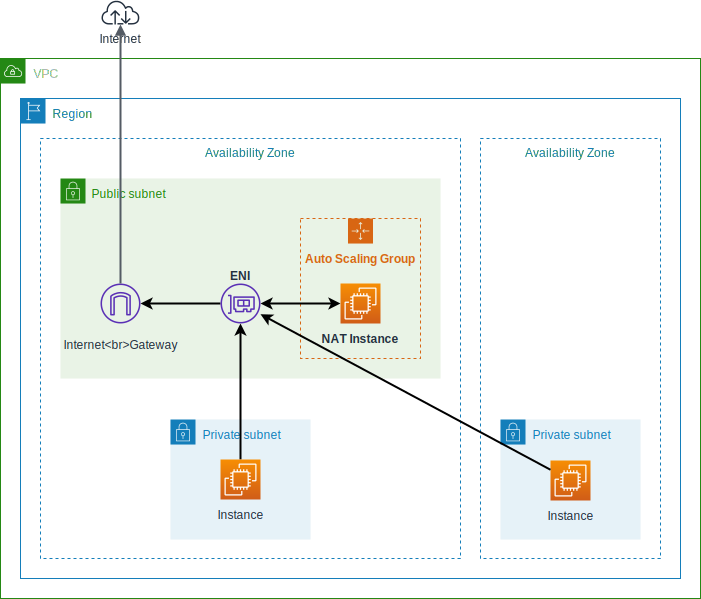

# terraform-aws-nat-instance [](https://circleci.com/gh/int128/terraform-aws-nat-instance)

This is a Terraform module which provisions a NAT instance.

Features:

- Providing NAT for private subnet(s)
- Auto healing using an auto scaling group
- Saving cost using a spot instance (from $1/month)
- Fixed source IP address by reattaching ENI
- Supporting Systems Manager Session Manager
- Compatible with workspaces

Terraform 0.12 or later is required.

**Warning**: Generally you should use a NAT gateway. This module provides a very low cost solution for testing purpose.


## Getting Started

You can use this module with [terraform-aws-modules/vpc/aws](https://registry.terraform.io/modules/terraform-aws-modules/vpc/aws) module as follows:

```tf
module "vpc" {
  source  = "terraform-aws-modules/vpc/aws"

  name                 = "main"
  cidr                 = "172.18.0.0/16"
  azs                  = ["us-west-2a", "us-west-2b", "us-west-2c"]
  private_subnets      = ["172.18.64.0/20", "172.18.80.0/20", "172.18.96.0/20"]
  public_subnets       = ["172.18.128.0/20", "172.18.144.0/20", "172.18.160.0/20"]
  enable_dns_hostnames = true
}

module "nat" {
  source = "int128/nat-instance/aws"

  name                        = "main"
  vpc_id                      = module.vpc.vpc_id
  public_subnet               = module.vpc.public_subnets[0]
  private_subnets_cidr_blocks = module.vpc.private_subnets_cidr_blocks
  private_route_table_ids     = module.vpc.private_route_table_ids
}

resource "aws_eip" "nat" {
  network_interface = module.nat.eni_id
  tags = {
    "Name" = "nat-instance-main"
  }
}
```

Now create an EC2 instance in the private subnet to verify the NAT configuration.
Open the [AWS Systems Manager Session Manager](https://docs.aws.amazon.com/systems-manager/latest/userguide/session-manager.html), log in to the instance and make sure you have external access from the instance.

See also the [example](example/).


## How it works

This module provisions the following resources:

- Auto Scaling Group with mixed instances policy
- Launch Template
- Elastic Network Interface
- Security Group
- IAM Role for SSM and ENI attachment
- VPC Route (optional)

You need to attach your elastic IP to the ENI.

Take a look at the diagram:



By default the latest Amazon Linux 2 image is used.
You can set `image_id` for a custom image.

The instance will execute [`runonce.sh`](runonce.sh) and [`snat.sh`](snat.sh) to enable NAT as follows:

1. Attach the ENI to `eth1`.
1. Set the kernel parameters for IP forwarding and masquerade.
1. Switch the default route to `eth1`.


## Configuration

### User data

You can set additional `write_files` and `runcmd` section. For example,

```tf
module "nat" {
  user_data_write_files = [
    {
      path : "/opt/nat/run.sh",
      content : file("./run.sh"),
      permissions : "0755",
    },
  ]
  user_data_runcmd = [
    ["/opt/nat/run.sh"],
  ]
}
```

See also [cloud-init modules](https://cloudinit.readthedocs.io/en/latest/topics/modules.html) and the [example](example/) for more.


### SSH access

You can enable SSH access by setting `key_name` option and opening the security group. For example,

```tf
module "nat" {
  key_name = "YOUR_KEY_PAIR"
}

resource "aws_security_group_rule" "nat_ssh" {
  security_group_id = module.nat.sg_id
  type              = "ingress"
  cidr_blocks       = ["0.0.0.0/0"]
  from_port         = 22
  to_port           = 22
  protocol          = "tcp"
}
```


## Migration guide

### Upgrade to v2 from v1

This module no longer creates an EIP since v2.

To keep your EIP when you migrate to module v2, rename the EIP in the state as follows:

```console
% terraform state mv -dry-run module.nat.aws_eip.this aws_eip.nat
Would move "module.nat.aws_eip.this" to "aws_eip.nat"

% terraform state mv module.nat.aws_eip.this aws_eip.nat
Move "module.nat.aws_eip.this" to "aws_eip.nat"
Successfully moved 1 object(s).
```

## Changes for latest version 3.0.0

Default is on-demand and not a spot instance. Also instance type is default t4g.nano to change this you need to add


instance_types = ["t3.nano"]

architecture = ["x86_64"]

## Contributions

This is an open source software. Feel free to open issues and pull requests.


<!--terraform-docs-->
## Requirements

No requirements.

## Providers

| Name | Version |
|------|---------|
| aws | n/a |

## Inputs

| Name | Description                                                                                                                   | Type | Default                                                  | Required |
|------|-------------------------------------------------------------------------------------------------------------------------------|------|----------------------------------------------------------|:--------:|
| <a name="input_enabled"></a> [enabled](#input\_enabled) | This variable is for enabling auto scaling desired capacity and minimum size in the auto scaling group.                       | `bool` | `true`                                                   | no |
| <a name="input_image_id"></a> [image\_id](#input\_image\_id) | AMI of the NAT instance. Default to the latest Amazon Linux 2                                                                 | `string` | `""`                                                     | no |
| <a name="input_instance_types"></a> [instance\_types](#input\_instance\_types) | Candidates of spot instance type for the NAT instance. This is used in the mixed instances policy                             | `list(string)` | <pre>[<br>  "t3.nano",<br>  "t3a.nano"<br>]</pre>        | no |
| <a name="input_key_name"></a> [key\_name](#input\_key\_name) | Name of the key pair for the NAT instance. You can set this to assign the key pair to the NAT instance                        | `string` | `""`                                                     | no |
| <a name="input_name"></a> [name](#input\_name) | Name for all the resources as identifier                                                                                      | `string` | n/a                                                      | yes |
| <a name="input_private_route_table_ids"></a> [private\_route\_table\_ids](#input\_private\_route\_table\_ids) | List of ID of the route tables for the private subnets. You can set this to assign the each default route to the NAT instance | `list(string)` | `[]`                                                     | no |
| <a name="input_private_subnets_cidr_blocks"></a> [private\_subnets\_cidr\_blocks](#input\_private\_subnets\_cidr\_blocks) | List of CIDR blocks of the private subnets. The NAT instance accepts connections from this subnets                            | `list(string)` | n/a                                                      | yes |
| <a name="input_public_subnet"></a> [public\_subnet](#input\_public\_subnet) | ID of the public subnet to place the NAT instance                                                                             | `string` | n/a                                                      | yes |
| <a name="input_ssm_policy_arn"></a> [ssm\_policy\_arn](#input\_ssm\_policy\_arn) | SSM Policy to be attached to instance profile                                                                                 | `string` | `"arn:aws:iam::aws:policy/AmazonSSMManagedInstanceCore"` | no |
| <a name="input_tags"></a> [tags](#input\_tags) | Tags applied to resources created with this module                                                                            | `map(string)` | `{}`                                                     | no |
| <a name="input_use_spot_instance"></a> [use\_spot\_instance](#input\_use\_spot\_instance) | Whether to use spot or on-demand EC2 instance                                                                                 | `bool` | `false`                                                  | no |
| <a name="input_user_data_runcmd"></a> [user\_data\_runcmd](#input\_user\_data\_runcmd) | Additional runcmd section of cloud-init                                                                                       | `list(list(string))` | `[]`                                                     | no |
| <a name="input_user_data_write_files"></a> [user\_data\_write\_files](#input\_user\_data\_write\_files) | Additional write\_files section of cloud-init                                                                                 | `list(any)` | `[]`                                                     | no |
| <a name="input_vpc_id"></a> [vpc\_id](#input\_vpc\_id) | ID of the VPC                                                                                                                 | `string` | n/a                                                      | yes |

## Outputs

| Name | Description |
|------|-------------|
| <a name="output_eni_id"></a> [eni\_id](#output\_eni\_id) | ID of the ENI for the NAT instance |
| <a name="output_eni_private_ip"></a> [eni\_private\_ip](#output\_eni\_private\_ip) | Private IP of the ENI for the NAT instance |
| <a name="output_iam_role_name"></a> [iam\_role\_name](#output\_iam\_role\_name) | Name of the IAM role for the NAT instance |
| <a name="output_sg_id"></a> [sg\_id](#output\_sg\_id) | ID of the security group of the NAT instance |
